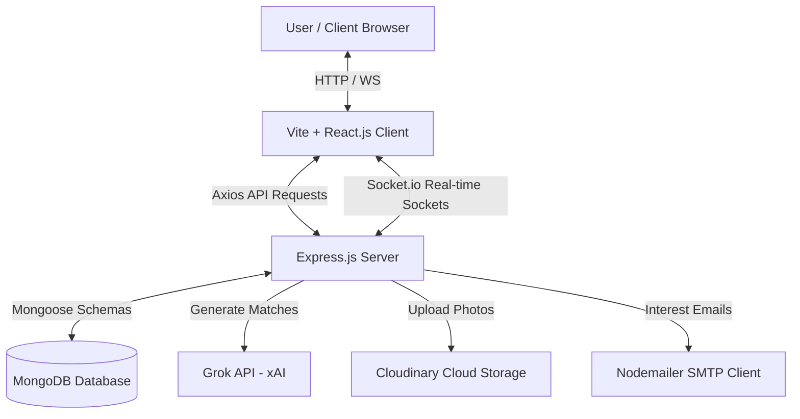

# RentHour AI - AI-Powered Room & Flatmate Finder

RentHour AI (RentMatch-AI) is a production-ready, fully responsive MERN stack application that leverages LLMs (xAI Grok API) to dynamically calculate compatibility scores between tenant profiles and room listings. 

It comes with a fully integrated real-time chat service (Socket.io) featuring typing status indicators, unread notification counts, seen receipts, and Nodemailer transactional templates (received, accepted, declined).

---

## 🏗️ Architecture Diagram



---

## 📂 Folder Structure

```text
RentMatch-AI/
├── package.json                   # Root orchestrator scripts
├── docker-compose.yml             # Local multi-container Docker compose
├── RentHour_AI.postman_collection.json # API endpoints import collection
├── README.md                      # Platform documentation
├── backend/
│   ├── server.js                  # Entry Express server file
│   ├── package.json               # Backend dependencies
│   ├── Dockerfile                 # Slim container image instructions
│   ├── config/                    # Mongoose and Cloudinary connections
│   ├── controllers/               # Auth, listings, messages, admin logic
│   ├── models/                    # Database schemas
│   ├── middleware/                # Protect checks, uploads, error handlings
│   ├── routes/                    # API endpoints routes
│   ├── services/                  # Grok, Sockets, and Email services
│   ├── scripts/                   # DB seeding script
│   └── tests/                     # Jest service test suites
└── client/
    ├── package.json               # Frontend dependencies
    ├── Dockerfile                 # Multi-stage image build script
    ├── nginx.conf                 # Container router fallback configs
    ├── index.html                 # Entry HTML template
    └── src/                       # React context, layouts, pages, components
```

---

## 🛠️ Installation & Setup

Follow these steps to run the application locally.

### 1. Prerequisites
- **Node.js** (v16 or higher)
- **MongoDB** running locally or a MongoDB Atlas connection string.

### 2. Configure Environment Files
Create a `.env` file in the `backend/` directory and `client/` directory using the provided templates:
- [backend/.env.example](file:///Users/adityasrivastava/Desktop/rent4u/backend/.env.example)
- [client/.env.example](file:///Users/adityasrivastava/Desktop/rent4u/client/.env.example)

### 3. Install All Dependencies
From the root directory, run:
```bash
npm run install-all
```

### 4. Seed the Database
Seed mock accounts, listings, and conversations:
```bash
npm run seed
```

### 5. Start in Development Mode
Start both backend API server and frontend Vite development server concurrently:
```bash
npm run dev
```
- Frontend will run at `http://localhost:5173`
- Backend API will run at `http://localhost:5000`

---

## 🐳 Docker Deployment (Local Containerization)

To run the entire ecosystem (MongoDB, Backend Node API, and Frontend served via Nginx) inside Docker, run the following command in the root folder:
```bash
docker-compose up --build
```
- React application will be available at `http://localhost` (Port 80)
- Backend Node API will run at `http://localhost:5000`

---

## 🧪 Running Automated Tests

Run backend Jest unit tests validating Grok matching logic and email templates:
```bash
npm run test
```

---

## 🌐 Deployment Guidelines

### Frontend (Vercel / Netlify)
1. Add environment variables:
   - `VITE_API_URL=https://your-backend-render-url.onrender.com/api`
   - `VITE_SOCKET_URL=https://your-backend-render-url.onrender.com`
2. Configure a `vercel.json` with rewrites pointing fallback paths to `/index.html` to prevent 404s on browser refreshes.

### Backend (Render / Railway)
1. Deploy as a Web Service.
2. Bind the port dynamically using the `PORT` environment variable.
3. Configure the environment variables checklist (`MONGO_URI`, `JWT_SECRET`, `EMAIL_USER`, etc.).

### Database (MongoDB Atlas)
1. Create a free shared cluster.
2. Whitelist Render/Vercel IP ranges (or select `0.0.0.0/0` access).
3. Retrieve connection string and copy to `MONGO_URI`.
