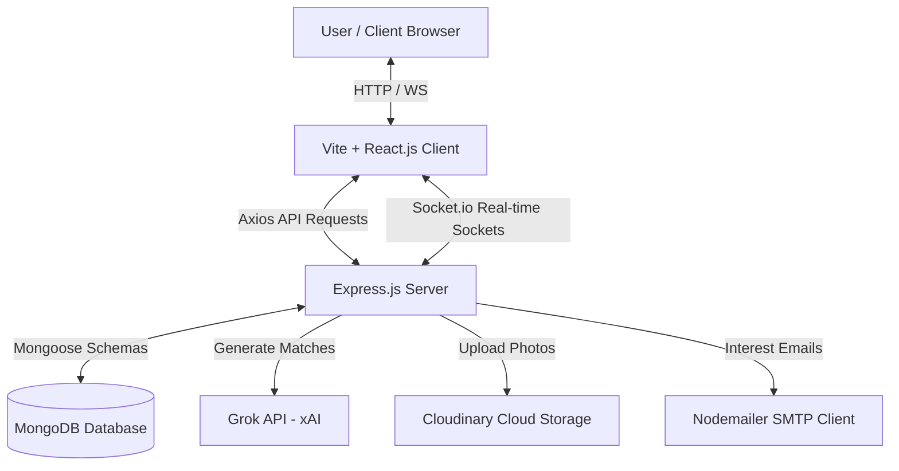

# RentHour AI - AI-Powered Room & Flatmate Finder

RentHour AI (RentMatch-AI) is a production-ready, fully responsive MERN stack application that leverages LLMs (xAI Grok API) to dynamically calculate compatibility scores between tenant profiles and room listings. 

It comes with a fully integrated real-time chat service (Socket.io) featuring typing status indicators, unread notification counts, seen receipts, and Nodemailer transactional templates (received, accepted, declined).

---

## 🏗️ Architecture Diagram



---

## 📂 Folder Structure

```text
RentMatch-AI/
├── package.json                   # Root orchestrator scripts
├── docker-compose.yml             # Local multi-container Docker compose
├── RentHour_AI.postman_collection.json # API endpoints import collection
├── README.md                      # Platform documentation
├── backend/
│   ├── server.js                  # Entry Express server file
│   ├── package.json               # Backend dependencies
│   ├── Dockerfile                 # Slim container image instructions
│   ├── config/                    # Mongoose and Cloudinary connections
│   ├── controllers/               # Auth, listings, messages, admin logic
│   ├── models/                    # Database schemas
│   ├── middleware/                # Protect checks, uploads, error handlings
│   ├── routes/                    # API endpoints routes
│   ├── services/                  # Grok, Sockets, and Email services
│   ├── scripts/                   # DB seeding script
│   └── tests/                     # Jest service test suites
└── client/
    ├── package.json               # Frontend dependencies
    ├── Dockerfile                 # Multi-stage image build script
    ├── nginx.conf                 # Container router fallback configs
    ├── index.html                 # Entry HTML template
    └── src/                       # React context, layouts, pages, components
```

---

## 🛠️ Installation & Setup

Follow these steps to run the application locally.

### 1. Prerequisites
- **Node.js** (v16 or higher)
- **MongoDB** running locally or a MongoDB Atlas connection string.

### 2. Configure Environment Files
Create a `.env` file in the `backend/` directory and `client/` directory using the provided templates:
- [backend/.env.example](file:///Users/adityasrivastava/Desktop/rent4u/backend/.env.example)
- [client/.env.example](file:///Users/adityasrivastava/Desktop/rent4u/client/.env.example)

### 3. Install All Dependencies
From the root directory, run:
```bash
npm run install-all
```

### 4. Seed the Database
Seed mock accounts, listings, and conversations:
```bash
npm run seed
```

### 5. Start in Development Mode
Start both backend API server and frontend Vite development server concurrently:
```bash
npm run dev
```
- Frontend will run at `http://localhost:5173`
- Backend API will run at `http://localhost:5000`

---

## 🐳 Docker Deployment (Local Containerization)

To run the entire ecosystem (MongoDB, Backend Node API, and Frontend served via Nginx) inside Docker, run the following command in the root folder:
```bash
docker-compose up --build
```
- React application will be available at `http://localhost` (Port 80)
- Backend Node API will run at `http://localhost:5000`

---

## 🧪 Running Automated Tests

Run backend Jest unit tests validating Grok matching logic and email templates:
```bash
npm run test
```

---

## 🌐 Deployment Guidelines

### Frontend (Vercel / Netlify)
1. Add environment variables:
   - `VITE_API_URL=https://your-backend-render-url.onrender.com/api`
   - `VITE_SOCKET_URL=https://your-backend-render-url.onrender.com`
2. Configure a `vercel.json` with rewrites pointing fallback paths to `/index.html` to prevent 404s on browser refreshes.

### Backend (Render / Railway)
1. Deploy as a Web Service.
2. Bind the port dynamically using the `PORT` environment variable.
3. Configure the environment variables checklist (`MONGO_URI`, `JWT_SECRET`, `EMAIL_USER`, etc.).

### Database (MongoDB Atlas)
1. Create a free shared cluster.
2. Whitelist Render/Vercel IP ranges (or select `0.0.0.0/0` access).
3. Retrieve connection string and copy to `MONGO_URI`.

---

## 🗄️ Database Schema

The database model consists of the following Collections:

### 1. User
* `name` (String, required)
* `email` (String, required, unique, lowercase)
* `password` (String, required, select: false)
* `phone` (String)
* `role` (String, enum: `['Tenant', 'Owner', 'Admin']`, default: `'Tenant'`)
* `avatar` (String, default: `''`)
* `verified` (Boolean, default: `false`)
* `deactivated` (Boolean, default: `false`)
* `savedListings` (Array of ObjectId refs to `RoomListing`)

### 2. RoomListing
* `owner` (ObjectId ref to `User`, required)
* `title` (String, required)
* `description` (String, required)
* `location` (String, Address/Street name, required)
* `city` (String, required)
* `state` (String, required)
* `latitude` (Number, required)
* `longitude` (Number, required)
* `rent` (Number, required)
* `deposit` (Number, required)
* `availableFrom` (Date, required)
* `roomType` (String, enum: `['Single', 'Shared', 'Entire Flat']`, required)
* `furnishing` (String, enum: `['Furnished', 'Semi-Furnished', 'Unfurnished']`, required)
* `amenities` (Array of Strings)
* `images` (Array of Strings)
* `status` (String, enum: `['available', 'filled']`, default: `'available'`)

### 3. TenantProfile
* `user` (ObjectId ref to `User`, required, unique)
* `preferredLocation` (String, required)
* `budgetMin` (Number, required)
* `budgetMax` (Number, required)
* `moveInDate` (Date, required)
* `occupation` (String)
* `gender` (String)
* `smoking` (String, enum: `['Yes', 'No']`)
* `pets` (String, enum: `['Yes', 'No']`)
* `foodPreference` (String, enum: `['Veg', 'Non-Veg', 'Any']`)
* `preferredBedrooms` (String, enum: `['Studio Room', '1 BHK', '2 BHK', '3 BHK', 'Any']`)
* `requiredAmenities` (Array of Strings)
* `about` (String)

### 4. Compatibility
* `tenant` (ObjectId ref to `User`, required)
* `listing` (ObjectId ref to `RoomListing`, required)
* `score` (Number, required, range: 0-100)
* `explanation` (String, required)
* `generatedBy` (String, enum: `['grok', 'fallback']`, default: `'grok'`)

### 5. Interest
* `tenant` (ObjectId ref to `User`, required)
* `owner` (ObjectId ref to `User`, required)
* `listing` (ObjectId ref to `RoomListing`, required)
* `status` (String, enum: `['pending', 'accepted', 'declined']`, default: `'pending'`)

### 6. Conversation
* `participants` (Array of ObjectId refs to `User`, length: 2)
* `listing` (ObjectId ref to `RoomListing`, required)
* `lastMessage` (ObjectId ref to `Message`)

### 7. Message
* `conversation` (ObjectId ref to `Conversation`, required)
* `sender` (ObjectId ref to `User`, required)
* `text` (String, required)
* `seen` (Boolean, default: `false`)

---

## 🔗 API Reference Docs

All routes are prefixed with `/api`. Protected routes require a valid bearer JWT in the `Authorization: Bearer <token>` header.

### 🔐 Authentication (`/api/auth`)
* `POST /register` - Register a new user (`name`, `email`, `password`, `phone`, `role`).
* `POST /login` - Authenticate credentials and return token + cookie.
* `POST /logout` - Invalidate cookie.
* `POST /refresh` - Re-verify refresh tokens.
* `POST /forgot` - Dispatches password reset link via Resend API (or SMTP fallback).
* `POST /reset/:token` - Updates user password.
* `GET /me` - Returns logged-in User profile and TenantProfile.
* `PUT /profile` - Saves profile details (supports profile avatar photo upload).
* `POST /verify` - Marks account identity verified.

### 🏡 Room Listings (`/api/listings`)
* `POST /` - Create a listing (multipart/form-data with image uploads, latitude, and longitude). [Owner Only]
* `GET /` - List all listings matching query filters (City, Rent, Room Type, amenities). Ranked automatically by AI Compatibility Match Score. [All]
* `GET /:id` - Get detailed page listing. Calculates/saves AI Compatibility score on first request.
* `PUT /:id` - Updates listing attributes (e.g. mark status as `filled`). [Owner Only]
* `DELETE /:id` - Deletes room listing. [Owner/Admin Only]
* `POST /generate-description` - Returns AI copywriting listing description paragraph.

### 🤝 Interest Logs (`/api/interest`)
* `POST /` - Express interest in a listing (triggers email notification to owner). [Tenant Only]
* `GET /` - List sent/received interest log entries.
* `PATCH /:id` - Accepts/declines interest status (triggers real-time chat room initialization + notifications). [Owner Only]

### 💬 Real-Time Chat (`/api/messages`)
* `GET /conversations` - List active chat channels contexted to accepted listing offers.
* `GET /conversations/:id/messages` - Returns scroll histories.

---

## 🧠 LLM Prompts & I/O Format

The platform leverages Groq (or xAI Grok fallback) for compatibility scoring. Below is the specification details:

### 1. Compatibility Matching Prompt
```text
You are an intelligent housing compatibility expert.
Given the tenant profile and room listing details, calculate their compatibility score between 0 and 100.
Consider details such as:
1. Budget match: Tenant preferred range is Rs. [budgetMin] to Rs. [budgetMax]. Listing rent is Rs. [rent].
2. Location match: Tenant preferred location is "[preferredLocation]". Listing is in "[location], [city], [state]".
3. Move-in compatibility: Tenant wants to move in on [moveInDate]. Listing is available from [availableFrom].
4. Room type compatibility: Listing room type is "[roomType]", furnishing is "[furnishing]".
5. Lifestyle compatibility: Tenant smoking preference is "[smoking]", pets preference is "[pets]", food preference is "[foodPreference]". Listing amenities are: [[amenities]]. Listing description is: "[description]".
6. Tenant details: Occupation: "[occupation]", gender: "[gender]", about tenant: "[about]".
7. Layout & Amenities Requirements: Tenant preferred bedrooms configuration is "[preferredBedrooms]", required amenities checklist is [[requiredAmenities]].

Generate a JSON response only. No conversational wrapper, no markdown blocks. The JSON must exactly conform to this schema:
{
  "score": 91,
  "explanation": "Brief explanation detailing the pros/cons of this match."
}
```

#### Example Output:
```json
{
  "score": 88,
  "explanation": "Excellent match! The listing's rent of ₹12,000 fits perfectly within the tenant's ₹10,000-₹15,000 budget. Both prefer a quiet, pet-friendly layout in Queens. The only minor drawback is the move-in availability, which is 1 week later than requested."
}
```

