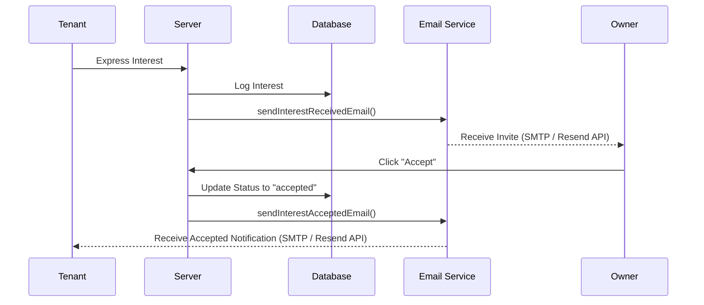

# RentHour AI: System Design Write-Up

## 1. Compatibility Scoring Design
The compatibility engine calculates match quality between a `TenantProfile` and a `RoomListing` on a scale from 0 to 100. Rather than performing heavy, runtime calculations on every query, scores are calculated asynchronously upon first search/details fetch and persisted in the `Compatibility` collection. 

When listings are fetched, they are sorted using MongoDB's aggregate pipelines that join (`$lookup`) listing entries with the cached compatibility score collection for that specific tenant. If a listing lacks a precomputed score, it triggers the matching service to calculate it, store it, and return it. This keeps search queries responsive (O(1) runtime score fetch) while keeping recommendations personalized.

---

## 2. LLM Integration & Graceful Fallback
We leverage a dual scoring service that integrates LLM endpoints with a deterministic local fallback validator:

* **Primary LLM Service:** Sends the tenant's lifestyle parameters (budget range, move-in dates, amenities checklist, food/pet preferences, and bio description) along with the listing's details to the Groq API (serving `llama-3.3-70b-versatile`) or xAI Grok endpoints. The model is forced to return a JSON object containing `{ "score": Number, "explanation": String }`.
* **Graceful Fallback:** If the LLM service suffers a network failure, API rate limit, or invalid response parsing, the system catches the error and executes `calculateRuleBasedScore()`. This local validator calculates scores deterministically by comparing budget overlap (40 pts), location keywords (20 pts), room configurations (10 pts), lifestyle compatibility (pet/smoking/food) (15 pts), and required amenities (15 pts). 
* **Persistence:** Both methods write their generated result back to the database, flagging the output as either generated by `grok` or `fallback`.

---

## 3. Real-Time Chat Implementation
Real-time chat is built on a custom event-driven WebSocket layer utilizing `Socket.io` with full persistence in a MongoDB instance:

* **Channel Scoping:** A `Conversation` is created and bound to a specific listing after the owner clicks "Accept" on a tenant's interest request. This scopes the room strictly to that transaction context.
* **Socket Lifecycles:** When clients log in, they connect to the socket namespace and join a dynamic channel identified by their `Conversation._id`.
* **User Status Tracking:** An active registry mapping user IDs to socket IDs is maintained in-memory on the server to broadcast status notifications:
  * `join_conversation` & `mark_seen`: Emits updates on message seen receipts and updates database flags.
  * `typing` & `stop_typing`: Emits real-time typing bubbles to the partner user.
* **Persistence:** Messages are immediately saved to the `Message` collection before broadcasting to the channel, ensuring chat history persists even if a user goes offline.

---

## 4. Notification Flow
Email notifications keep users engaged through critical transaction lifecycle changes:

* **Event Triggers:** 
  1. A tenant expresses interest -> Owner receives `sendInterestReceivedEmail()`.
  2. An owner accepts interest -> Tenant receives `sendInterestAcceptedEmail()`.
  3. A user requests a password change -> User receives `sendPasswordResetEmail()`.
* **Port 443 API Dispatch:** To bypass standard SMTP port blocking common in cloud platforms like Render and Railway, the email helper prioritizes HTTP-based API calls (Resend/SendGrid) over port `443` instead of traditional Nodemailer SMTP, falling back to local SMTP credentials only if API keys are not provided.
